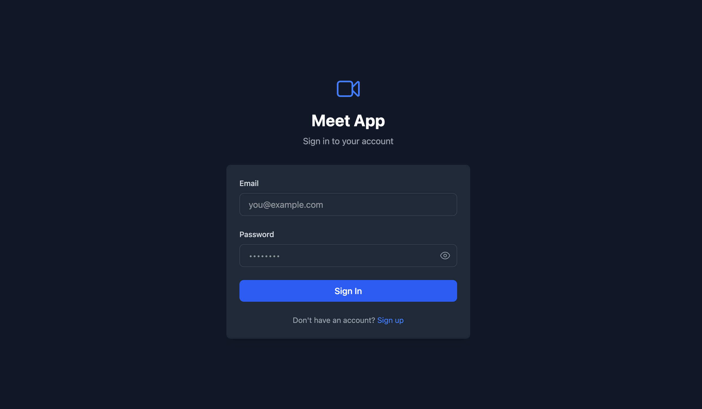
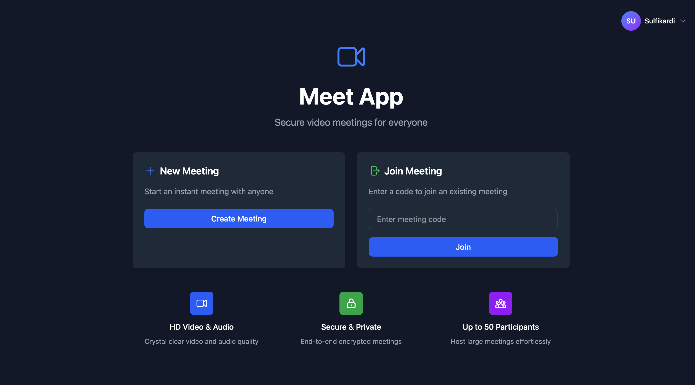
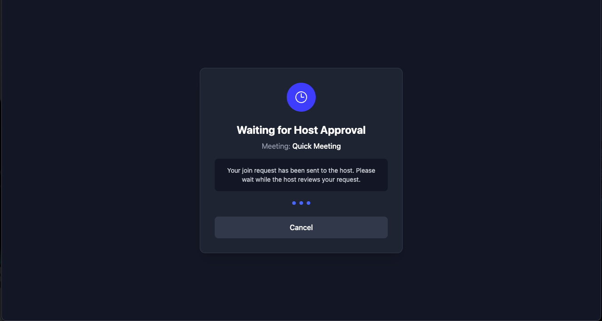
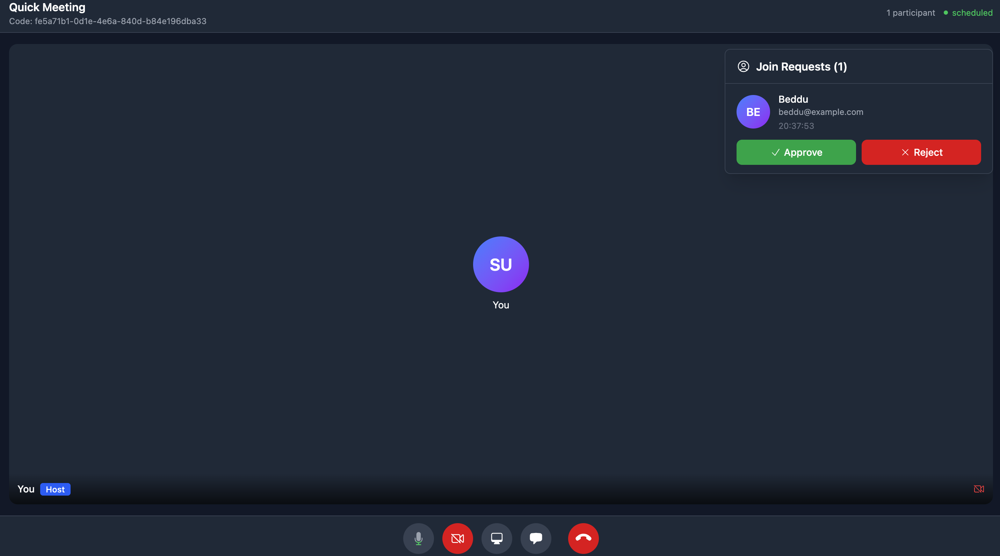
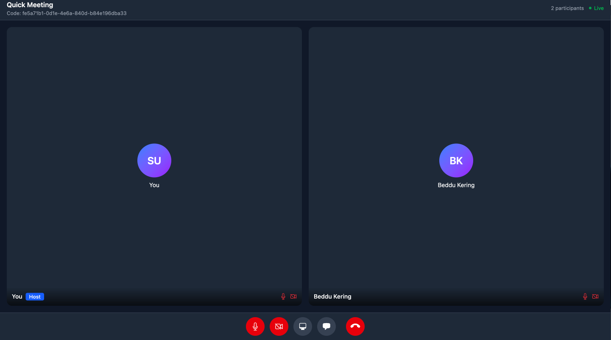
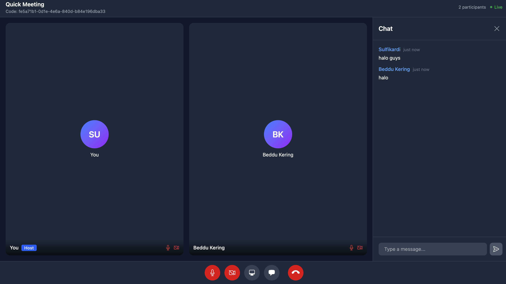

# Meet App - Video Conferencing Application

A modern video conferencing application built with **Golang**, **React TypeScript**, and **Tailwind CSS**. Features real-time video calls, chat messaging, and host approval system.

## ✨ Features

### Authentication & Security
- ✅ User registration and login with JWT authentication
- ✅ Secure session management
- ✅ Password hashing with bcrypt

### Meeting Management
- ✅ Create instant meetings with unique codes (UUID-based)
- ✅ Join meetings via meeting code
- ✅ **Host approval system** - First-time join requires host approval
- ✅ **Auto-approval for returning users** - No approval needed for reload/rejoin
- ✅ Waiting room for pending approval
- ✅ Real-time participant list
- ✅ Host controls and participant management

### Video Conferencing
- ✅ Real-time peer-to-peer video streaming (WebRTC)
- ✅ Audio/Video toggle controls
- ✅ Camera on/off with avatar fallback (initials)
- ✅ Microphone mute/unmute
- ✅ Video mirroring control
- ✅ Real-time media state synchronization
- ✅ Adaptive video grid layout (1-9+ participants)
- ✅ Audio level indicators
- ✅ Responsive video controls

### Real-time Communication
- ✅ Real-time text chat (Server-Sent Events)
- ✅ Chat message history
- ✅ Message persistence in database
- ✅ WebRTC signaling via WebSocket
- ✅ Media state broadcasting

### User Interface
- ✅ Modern, responsive design (Mobile & Desktop)
- ✅ Profile avatar with user initials
- ✅ Meeting header with participant count
- ✅ Chat panel with slide-in animation
- ✅ Media control buttons
- ✅ Leave meeting confirmation modal
- ✅ Error handling with user-friendly messages
- ✅ Loading states and animations

### Architecture Highlights
- ✅ Hybrid communication (WebSocket + SSE + REST)
- ✅ P2P video streaming (reduced server load)
- ✅ Optimized for scalability
- ✅ Clean architecture with separation of concerns

## 📸 Screenshots

### Login Page


### Home Page


### Waiting for Approval


### Host Approval Notification


### Meeting with Participants


### Real-time Chat


## 🚀 Quick Start

### Prerequisites
- Go 1.21+
- Node.js 18+
- Docker & Docker Compose
- PostgreSQL 15+

### 1. Clone Repository
```bash
git clone <repository-url>
cd meet-app
```

### 2. Start Infrastructure
```bash
docker-compose up -d
```

### 3. Run Backend
```bash
cd meet-app-backend
go build -o server ./cmd/server
./server
```

### 4. Run Frontend
```bash
cd meet-app-frontend
npm install
npm run dev
```

### 5. Access Application
- **Frontend**: http://localhost:5173
- **Backend API**: http://localhost:8080

## 🛠️ Tech Stack

### Frontend
- React 18 with TypeScript
- Tailwind CSS for styling
- WebRTC for video streaming
- WebSocket for signaling
- SSE for real-time chat
- Axios for API calls

### Backend
- Golang with Gin framework
- PostgreSQL with GORM
- gorilla/websocket for WebSocket
- JWT authentication
- SSE (Server-Sent Events) for chat
- Docker for containerization

## 🎯 How It Works

### Join Meeting Flow
1. **First-time User**:
   - User joins meeting → Wait in approval screen
   - Host receives notification → Approve/Reject
   - On approval → User enters meeting

2. **Returning User** (Reload/Rejoin):
   - User joins meeting → Auto-approved ✓
   - No host approval needed ✓
   - Instant access to meeting

### Video Streaming
- Peer-to-peer connections using WebRTC
- STUN server for NAT traversal
- Optimized bandwidth usage
- Automatic video quality adaptation

### Chat System
- Server-Sent Events (SSE) for real-time delivery
- Message persistence in PostgreSQL
- Chat history on join
- Efficient one-way communication

## 📁 Project Structure

```
meet-app/
├── meet-app-backend/        # Golang backend
│   ├── cmd/server/         # Application entry point
│   ├── internal/
│   │   ├── api/            # REST API handlers
│   │   ├── websocket/      # WebSocket & WebRTC signaling
│   │   ├── sse/            # Server-Sent Events
│   │   ├── models/         # Database models
│   │   ├── service/        # Business logic
│   │   └── repository/     # Data access layer
│   └── pkg/                # Shared packages
│
├── meet-app-frontend/       # React TypeScript frontend
│   ├── src/
│   │   ├── components/     # Reusable components
│   │   │   ├── Common/     # Avatar, Header, Modal
│   │   │   ├── Controls/   # Media controls
│   │   │   ├── Chat/       # Chat panel
│   │   │   ├── Error/      # Error messages
│   │   │   └── Meeting/    # Join approval components
│   │   ├── pages/          # Page components
│   │   ├── services/       # API & WebSocket services
│   │   ├── hooks/          # Custom React hooks
│   │   └── types/          # TypeScript types
│   └── tailwind.config.js
│
├── UI/                      # Screenshots
├── docker-compose.yml       # Infrastructure setup
└── README.md
```

## 🔐 Environment Variables

### Backend (.env)
```bash
PORT=8080
DB_HOST=localhost
DB_PORT=5432
DB_USER=meetapp
DB_PASSWORD=meetapp123
DB_NAME=meetapp
JWT_SECRET=your-secret-key
```

### Frontend (.env)
```bash
VITE_API_URL=http://localhost:8080
VITE_WS_URL=ws://localhost:8080
```

## 📦 Build for Production

### Backend
```bash
cd meet-app-backend
go build -o server ./cmd/server
```

### Frontend
```bash
cd meet-app-frontend
npm run build
```

## 🤝 Contributing

Contributions are welcome! Please feel free to submit a Pull Request.

## 📝 License

This project is licensed under the MIT License.

---

**Version**: 1.0
**Last Updated**: 2025-11-25
